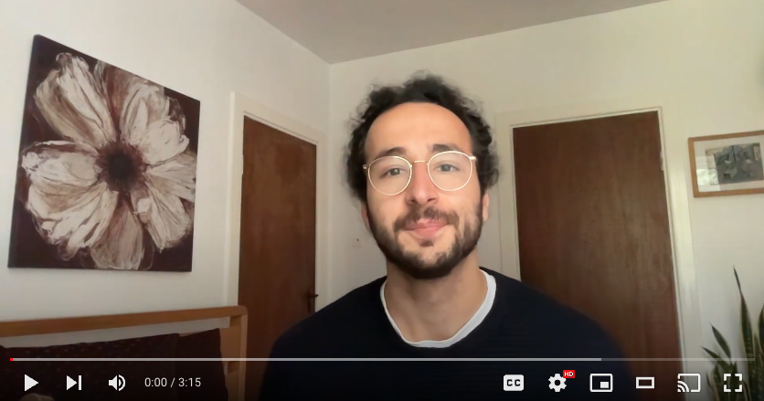

Hi, I'm a sofware engineer aspiring to get into the world of data.

# ML Projects

## Recipe Generator [[Link]](https://github.com/stephankostov/recipe-generator)

A project to have fun and practice data wrangling and training models.

- Data Engineering
- Model Architecture Design
- Model Training

## Podcast Transcriber [[Link]](https://github.com/stephankostov/podcast-transcriber) 

A practical project to help notetaking.

- AI-Agent Development
- NLP
- LLM Prompt Engineering

## Data Analytics MSc Dissertation [[Link]](https://github.com/stephankostov/msc-data-analysis-thesis)

My first real taste of working with data.

- Data Analysis
- Data Visualisation

## Image Generation Model Fine-Tuning

Project to practice my skills learned after completing a course on creating and training diffusion models [FastAI: Practical AI for Deep Learning (Part 2)](https://course.fast.ai/Lessons/lesson9.html). Here I fine-tuned Stable Diffusion for help generating character artwork for my friends' Dungeons and Dragons campaigns.

- Model Training
- Model Architecture Design
- Large Model Fine-Tuning
- Machine Learning Foundations

# Reading List

- [Deep Learning for Coders with fastai and PyTorch by Jeremy Howard and Sylvain Gugger](https://www.oreilly.com/library/view/deep-learning-for/9781492045519/)
- [Course: Deep Learning Foundations to Stable Diffusion by Jeremy Howard](https://course.fast.ai/Lessons/part2.html)
- [Python for Data Analysis by Wes McKinney](https://wesmckinney.com/book/)
- [Designing Machine Learning Systems by Chip Huyen](https://www.oreilly.com/library/view/designing-machine-learning/9781098107956/)
- [Mathematics for Machine Learning by Marc Peter Deisenroth, A. Aldo Faisal, and Cheng Soon Ong](https://mml-book.github.io/)

# CV

[PDF](./stephan-kostov-cv.pdf)
